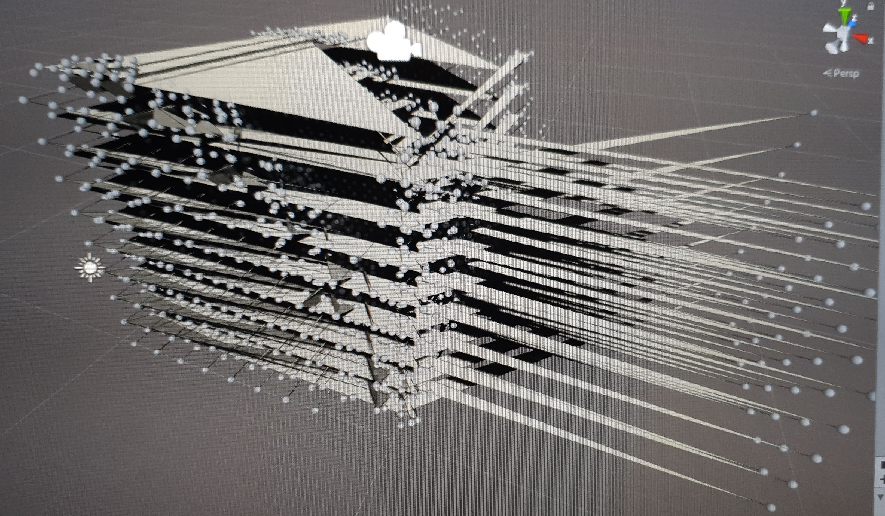
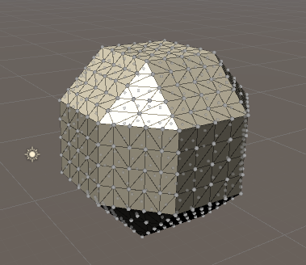
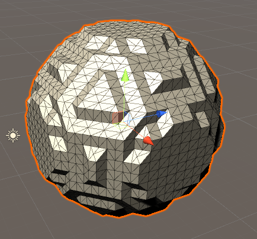
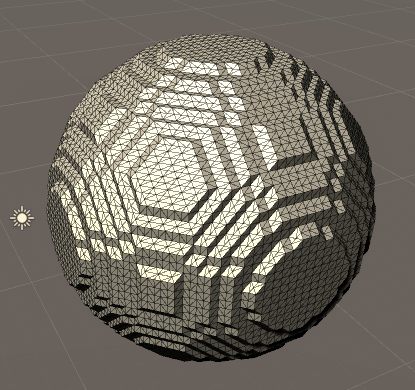
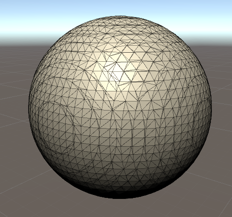

# Marching Cubes
The goal of this project is to learn more about Unity and how to generate a world using marching cubes and a function (e.g. noise).
 
I will have to learn how to generate meshes from code and probably how to write shaders in Unity, since I might need more performance once I
move from a small test area to an infinite world.

## Resources
Mesh generation in Unity (basics):
- [Generating a triangle](https://www.youtube.com/watch?v=eJEpeUH1EMg)
- [Generating an area + perlin noise](https://www.youtube.com/watch?v=64NblGkAabk)

## Implementing the algorithm
The algorithm was fairly straightforward to implement, especially since I didn't need to create the edge table and triangle table myself.
After a few failures

 
I was able to get it to work and create a sphere, after a few adjustments even with varying detail (Smaller steps between points).

 
In the end however this was not enough to create a smooth sphere, since Unity caps the amount of triangle indices at ~65000 (I think it's at 65,535, which would be 2 unsigned bytes).
 
Also the amount of triangles needed for a sphere is way to much if done only by increasing the detail and takes way too long to calculate. Therefore I added an interpolation that doesn't just take the center of two points, as I did in the beginning, and lo and behold, we get a great result with surprisingly low detail.

